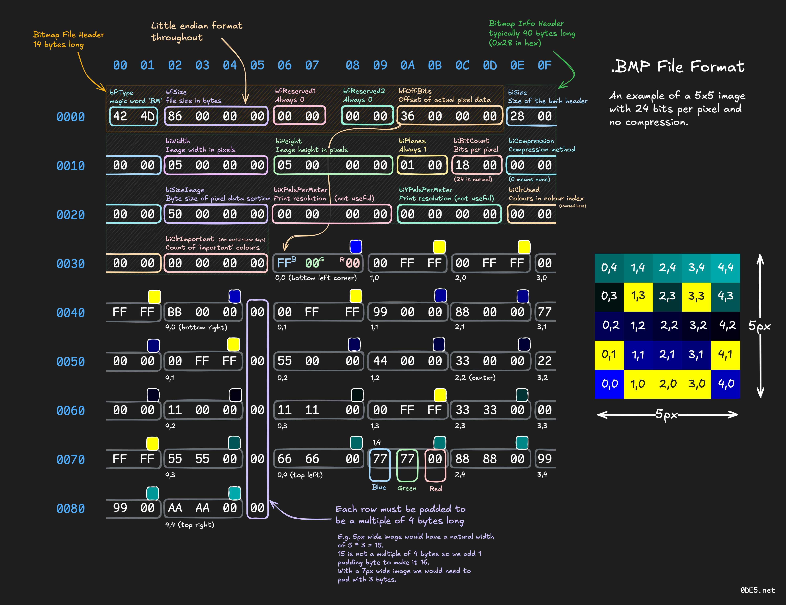

# bmp-viewer

A 24 Bit RGB uncompressed Bitmap file viewer for your terminal written in Ruby.

## Usage

In your ruby file:

```rb
# main.rb

bmp = Bmp.from_file_path("./input/rgb24.bmp")

rotated = bmp.rotate_90
gray_rotated = rotated.grayscale

gray_rotated.print_bmp
```

And then:

```bash
ruby main.rb
```

## Sample output


## Reference Sheet

Credit: [0DE5](https://www.0de5.net/stimuli/binary-formats-through-bitmap-images).



